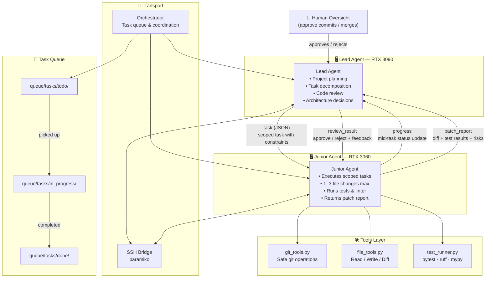

# 🧠 DualMind Dev

> A hierarchical multi-agent local LLM development system where two AI agents collaborate over a structured task protocol — a **Lead Agent** (senior, high-end GPU) and a **Junior Agent** (executor, secondary machine) — exchanging tasks, diffs, progress reports, and test results to autonomously build software projects with human oversight.

---

## Architecture



## Communication Protocol

All inter-agent messages are typed JSON objects:

| Message Type     | Direction          | Description                        |
|------------------|--------------------|-------------------------------------|
| `task`           | Lead → Junior      | Scoped task with constraints        |
| `progress`       | Junior → Lead      | Mid-task status update              |
| `patch_report`   | Junior → Lead      | Diff + test results + risks         |
| `review_result`  | Lead → Junior      | Approve / reject with feedback      |

---

## Project Structure

```
dualmind-dev/
├── agents/
│   ├── lead_agent.py        # Lead agent logic
│   └── junior_agent.py      # Junior agent logic
├── core/
│   ├── orchestrator.py      # Task queue & coordination
│   ├── protocol.py          # Message schemas (Pydantic)
│   └── ssh_bridge.py        # SSH transport layer
├── tools/
│   ├── git_tools.py         # Safe git operations
│   ├── file_tools.py        # Read/write/diff helpers
│   └── test_runner.py       # pytest / ruff / mypy runner
├── queue/
│   └── tasks/               # JSON task files (todo/in_progress/done)
├── config.yaml              # Machine addresses, model endpoints
├── main.py                  # Entry point
├── requirements.txt
└── README.md
```

---

## Quickstart

```bash
# 1. Clone and install
git clone https://github.com/Totsamuychel/DualMind-Dev
cd DualMind-Dev
pip install -r requirements.txt

# 2. Configure machines
cp config.yaml.example config.yaml
# Edit config.yaml with your machine IPs and model endpoints

# 3. Run
python main.py
```

## Safety Rules

- ✅ Junior agent works **only in feature branches**, never main
- ✅ All commits require **human approval** before merge
- ✅ Junior agent has **read-only SSH** except for its sandbox dir
- ✅ No autonomous `git push` to main or `git merge`
- ✅ Every change validated by tests + linter before reporting back

---

## Stack

- **Models**: Any Ollama-compatible local LLM (Qwen2.5-Coder, DeepSeek-Coder, etc.)
- **Transport**: SSH via `paramiko`
- **Schema**: Pydantic v2
- **Git ops**: GitPython
- **Tests**: pytest + ruff + mypy
