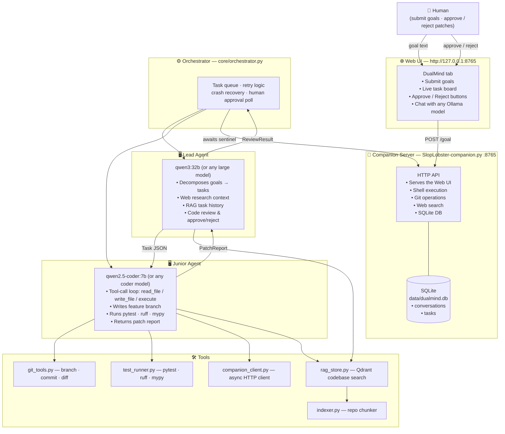

# DualMind Dev

> A hierarchical multi-agent local LLM development system. A **Lead Agent** plans and reviews; a **Junior Agent** executes scoped coding tasks. Both run on Ollama-served local models. A web UI lets you submit goals, watch the pipeline in real time, and approve or reject every patch before it lands.

---

## Architecture



---

## Communication Protocol

All inter-agent messages are typed Pydantic objects serialised to JSON:

| Type | Direction | Fields |
|------|-----------|--------|
| `Task` | Lead → Junior | `id`, `title`, `description`, `files_in_scope`, `constraints`, `acceptance_criteria`, `branch` |
| `ProgressReport` | Junior → Orchestrator | `task_id`, `iteration`, `files_written`, `note` |
| `PatchReport` | Junior → Lead | `branch`, `diff`, `files_changed`, `test_results`, `lint_passed`, `typecheck_passed`, `risks` |
| `ReviewResult` | Lead → Orchestrator | `task_id`, `approved`, `feedback`, `requested_changes` |

---

## Pipeline Flow

```
Human types goal in UI
  → POST /goal → queue/goals.txt
    → Lead: research + RAG history → decompose into Tasks
      → Junior: tool-call loop (read / write / execute)
        → pytest + ruff + mypy
          → PatchReport to Lead
            → Lead reviews diff
              → approved? → UI shows "Pending Human Review"
                → Human clicks Approve → status = done in SQLite
                  → Orchestrator merges; records outcome in RAG
              → rejected? → Junior retries with feedback (max 2 retries)
```

---

## Project Structure

```
DualMind-Dev/
├── agents/
│   ├── lead_agent.py          # Goal decomposition, research, code review
│   └── junior_agent.py        # Tool-call loop, file I/O, quality checks
├── core/
│   ├── orchestrator.py        # Task queue, retry logic, human approval poll
│   ├── protocol.py            # Pydantic schemas (Task, PatchReport, …)
│   └── ssh_bridge.py          # Optional SSH transport (use_ssh: false by default)
├── tools/
│   ├── companion_client.py    # Async HTTP client for companion server
│   ├── git_tools.py           # Branch · stage · commit · diff (via companion)
│   ├── test_runner.py         # pytest · ruff · mypy (via companion)
│   ├── rag_store.py           # Qdrant vector search (optional)
│   ├── indexer.py             # AST-aware repo chunker for RAG
│   └── file_tools.py          # Low-level file helpers
├── tg_bot/                    # Optional Telegram bot for remote approval
│   ├── bot.py
│   ├── notify.py
│   └── monitor.py
├── tests/                     # pytest test suite
├── ui/
│   └── SlopLobster.html       # Full-featured web UI (served by companion)
├── SlopLobster-companion.py   # Companion server: shell, git, search, SQLite, serves UI
├── config.yaml                # Your local config (gitignored)
├── config.yaml.example        # Template
├── main.py                    # Entry point — starts orchestrator + companion
├── requirements.txt
└── data/
    └── dualmind.db            # SQLite: conversations + tasks (auto-created)
```

---

## Quickstart

### 1. Install

```bash
git clone https://github.com/Totsamuychel/DualMind-Dev
cd DualMind-Dev
pip install -r requirements.txt
```

### 2. Configure

```bash
cp config.yaml.example config.yaml
```

Edit `config.yaml`:

```yaml
lead_agent:
  model_endpoint: http://localhost:11434   # Ollama on your main machine
  model_name: qwen3:32b                    # or any large reasoning model

junior_agent:
  use_ssh: false                           # true if Junior is on a separate machine
  model_endpoint: http://localhost:11434
  model_name: qwen2.5-coder:7b            # or any coder model
  sandbox_dir: ./sandbox

qdrant:
  url: ""                                  # leave empty to disable RAG
```

### 3. Start Ollama

```bash
# Required for CORS when the UI accesses Ollama directly
OLLAMA_ORIGINS=* ollama serve
ollama pull qwen3:32b
ollama pull qwen2.5-coder:7b
```

### 4. Run

```bash
python main.py
```

Then open **http://127.0.0.1:8765/** in your browser.

---

## Using the UI

| Action | How |
|--------|-----|
| Chat with a model | Select backend (Ollama / LM Studio / llama.cpp), pick a model, type |
| Submit a goal to DualMind | Open the **DualMind** tab in the right panel → type goal → Send |
| Watch the pipeline | Task board updates live every 3 s |
| Approve a patch | Click **Approve** on a task card |
| Reject with feedback | Click **Reject**, type reason |
| Pin a model | Click the pin icon next to the model selector |
| Disable tool calling | Click the tools toggle (for models that don't support it) |
| File context | Open a file in the right panel — its content is injected into every message |

---

## Optional: RAG (Qdrant)

```bash
docker run -p 6333:6333 qdrant/qdrant
```

Set `qdrant.url: http://localhost:6333` in `config.yaml`. On first run the indexer walks the repository and populates the `codebase` collection. Junior and Lead get semantically relevant code snippets in every prompt.

---

## Optional: Telegram Bot

Set `telegram.token` in `config.yaml`. The bot sends a message when a task is ready for human review, and accepts `/approve <id>` / `/reject <id>` commands.

---

## Safety

- Junior always commits to a **feature branch**, never `main`
- No automatic `git push` or `git merge` — all merges are manual
- Blocked shell commands: `git push`, `git merge`, `git reset --hard`, `rm -rf`, `sudo`
- Every patch validated by **pytest + ruff + mypy** before going to Lead review
- Lead hard-rejects patches with failing tests or lint without calling the LLM
- Human approve/reject is the final gate before any code lands

---

## Stack

| Layer | Tech |
|-------|------|
| Models | Ollama — any local LLM (`qwen3`, `qwen2.5-coder`, `deepseek-coder`, …) |
| Schemas | Pydantic v2 |
| HTTP client | httpx (async) |
| Companion server | Python stdlib `http.server` |
| Database | SQLite 3 (stdlib) |
| Git | Shell via companion |
| Quality checks | pytest · ruff · mypy |
| RAG (optional) | Qdrant + `sentence-transformers` |
| SSH (optional) | paramiko |
| Telegram (optional) | python-telegram-bot |
